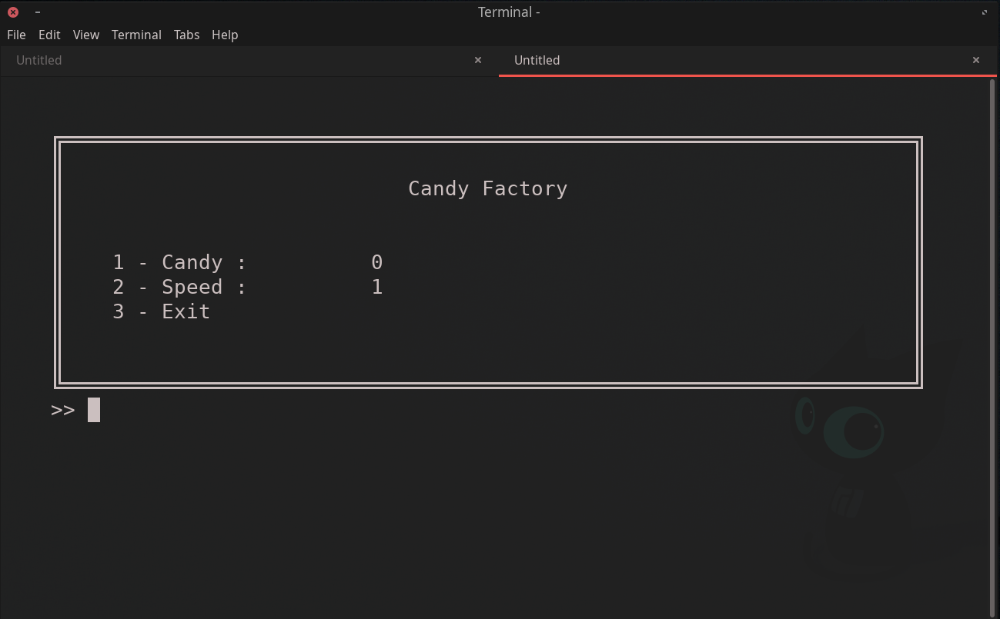

# Candy Factory Menu
A small project to serve as a template for applications using the ConsoleMenu python package

## This project is useful when...
you need a MENU but you are not willing to drop down a full (and very timeconsuming) GUI application inside your python project.

Here it is how it looks on my computer. Feel free to copy and learn from this project :)

## Instructions
I highly encourage you to go the project's page:
https://github.com/aegirhall/console-menu

There you can find instalation instructions for the package and very useful examples inside the "examples" folder.